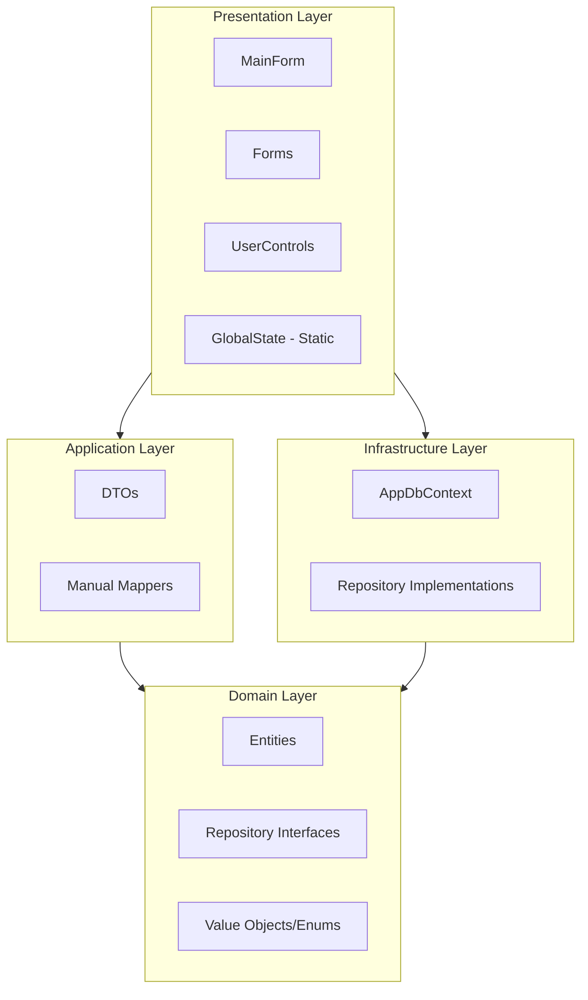

# HMS Project Analysis & Improvement Suggestions

## Project Overview

| Attribute | Value |
|-----------|-------|
| **Type** | Windows Forms Desktop Application |
| **Framework** | .NET 8.0 (Windows) |
| **Architecture** | Clean Architecture (4-layer) |
| **ORM** | Entity Framework Core 8.0.21 + SQL Server |
| **DI Container** | Microsoft.Extensions.DependencyInjection |
| **Entities** | Department, Staff, Doctor, Patient, User |

---

## Current Architecture Summary



---

## Dependencies Analysis

### Current NuGet Packages

| Package | Version | Usage | Migration Potential |
|---------|---------|-------|---------------------|
| `Microsoft.EntityFrameworkCore` | 8.0.21 | ORM | ❌ Core dependency, keep |
| `Microsoft.EntityFrameworkCore.SqlServer` | 8.0.21 | DB Provider | ❌ Core dependency, keep |
| `Microsoft.EntityFrameworkCore.Design` | 8.0.21 | Migrations | ❌ Required for EF tooling |
| `Microsoft.Extensions.Configuration` | 10.0.0 | Config | ⚠️ Version mismatch with .NET 8 |
| `Microsoft.Extensions.Configuration.Json` | 10.0.0 | JSON config | ⚠️ Version mismatch |
| `Microsoft.Extensions.DependencyInjection` | 8.0.1 | DI | ❌ Lightweight, keep |

> **⚠️ WARNING**: `Microsoft.Extensions.Configuration*` packages are at version 10.0.0 while the project targets .NET 8. Downgrade to 8.x.x for consistency and stability.

---

## Performance Issues & Improvements

### 🔴 Critical Performance Issues

#### 1. O(n²) Complexity in `CellFormatting` Events

**Location**: `DoctorsControl.cs:L42-60`, `StaffsControl.cs:L43-53`

**Problem**: Every cell formatting event triggers LINQ `FirstOrDefault()` lookups against `GlobalState` collections.

```csharp
// Current: O(n) lookup per cell, O(n²) total for grid
dgvDoctor.CellFormatting += (s, e) => {
    var staff = GlobalState.Staffs.FirstOrDefault(s => s.StaffId == doctor.StaffId); // ❌ O(n)
    var department = GlobalState.Departments.FirstOrDefault(...); // ❌ O(n)
};
```

**Solution**: Pre-build Dictionary lookups for O(1) access.

```csharp
// Improved: O(1) lookup using Dictionary
private Dictionary<string, StaffDto> _staffLookup = new();
private Dictionary<string, DepartmentDto> _deptLookup = new();

private void RefreshLookups()
{
    _staffLookup = GlobalState.Staffs.ToDictionary(s => s.StaffId);
    _deptLookup = GlobalState.Departments.ToDictionary(d => d.DepartmentId);
}

dgvDoctor.CellFormatting += (s, e) => {
    if (_staffLookup.TryGetValue(doctor.StaffId, out var staff)) // ✅ O(1)
    {
        row.Cells["colCode"].Value = staff.Code;
    }
};
```

---

#### 2. Static Mutable Global State

**Location**: `GlobalState.cs`

**Problem**: 
- Thread-safety issues with concurrent access
- Tight coupling across all controls
- No encapsulation - any component can modify state
- Memory leaks potential with static `BindingList`

**Solution**: Implement **State Management Pattern** (similar to Redux/Flux)

```csharp
public interface IAppStateStore
{
    IReadOnlyList<DepartmentDto> Departments { get; }
    IReadOnlyList<StaffDto> Staffs { get; }
    event Action<StateChange>? OnStateChanged;
    
    void UpdateDepartments(IEnumerable<DepartmentDto> departments);
    void UpdateStaffs(IEnumerable<StaffDto> staffs);
}

public class AppStateStore : IAppStateStore
{
    private readonly object _lock = new();
    private List<DepartmentDto> _departments = new();
    
    public IReadOnlyList<DepartmentDto> Departments 
    { 
        get { lock (_lock) return _departments.AsReadOnly(); } 
    }
    
    public void UpdateDepartments(IEnumerable<DepartmentDto> departments)
    {
        lock (_lock)
        {
            _departments = departments.ToList();
        }
        OnStateChanged?.Invoke(new StateChange(StateType.Departments));
    }
}
```

---

#### 3. Redundant Database Queries on Control Switch

**Location**: `MainForm.cs:L165-197`

**Problem**: All data is loaded at startup, but individual controls also have refresh functionality that reloads. No caching strategy.

**Solution**: Implement **Cache-Aside Pattern** with invalidation timestamps.

```csharp
public interface ICacheService
{
    Task<T?> GetOrSetAsync<T>(string key, Func<Task<T>> factory, TimeSpan? expiry = null);
    void Invalidate(string key);
}
```

---

### 🟠 Medium Priority Issues

#### 4. Synchronous Exception Wrapping in Repository

**Location**: `GenericRepository.cs`

**Problem**: Generic exception wrapping loses stack trace and original exception context.

**Solution**: Use **Result Pattern** for explicit error handling:

```csharp
public record Result<T>
{
    public bool IsSuccess { get; init; }
    public T? Value { get; init; }
    public string? Error { get; init; }
    
    public static Result<T> Success(T value) => new() { IsSuccess = true, Value = value };
    public static Result<T> Failure(string error) => new() { IsSuccess = false, Error = error };
}
```

---

#### 5. Hard-coded Timezone Offset

**Location**: `AppDbContext.cs:L27-34`

**Problem**: 
```csharp
dept.UpdatedAt = DateTime.UtcNow.AddHours(7); // ❌ Hard-coded Cambodia timezone
```

**Solution**: Use `DateTimeOffset` or inject timezone configuration via `appsettings.json`.

---

#### 6. Debounce Timer Not Disposed

**Location**: All UserControls with search functionality

```csharp
private System.Windows.Forms.Timer? _searchTimer; // ❌ Never disposed
```

**Solution**: Implement `IDisposable`:

```csharp
protected override void Dispose(bool disposing)
{
    if (disposing)
    {
        _searchTimer?.Dispose();
    }
    base.Dispose(disposing);
}
```

---

## Library Migration Assessment

### ✅ Already Manual (No Migration Needed)

| Component | Current State | Notes |
|-----------|---------------|-------|
| **Mappers** | Manual extension methods | Already implements manual mapping pattern |
| **Validation** | Property setters with validation | Domain-level validation in entities |
| **DI Container** | Microsoft.Extensions.DependencyInjection | Already lightweight |

### ⚠️ Potential Enhancements

#### Expression-Based Mapping (Optional)

While the current manual mappers are lightweight, they can be enhanced with compile-time expression trees:

```csharp
public static class FastMapper<TSource, TTarget> where TTarget : new()
{
    private static readonly Func<TSource, TTarget> _mapper = CreateMapper();
    
    private static Func<TSource, TTarget> CreateMapper()
    {
        var sourceParam = Expression.Parameter(typeof(TSource), "src");
        var bindings = typeof(TTarget).GetProperties()
            .Where(p => typeof(TSource).GetProperty(p.Name) != null)
            .Select(p => Expression.Bind(p, 
                Expression.Property(sourceParam, typeof(TSource).GetProperty(p.Name)!)));
        
        var body = Expression.MemberInit(Expression.New(typeof(TTarget)), bindings);
        return Expression.Lambda<Func<TSource, TTarget>>(body, sourceParam).Compile();
    }
    
    public static TTarget Map(TSource source) => _mapper(source);
}
```

---

## Design Pattern Recommendations

### 1. Unit of Work Pattern

**Problem**: Each repository calls `SaveChangesAsync()` independently.

```csharp
public interface IUnitOfWork : IDisposable
{
    IGenericRepository<Department> Departments { get; }
    IGenericRepository<Staff> Staffs { get; }
    IDoctorRepository Doctors { get; }
    
    Task<int> SaveChangesAsync(CancellationToken cancellationToken = default);
    Task BeginTransactionAsync();
    Task CommitAsync();
    Task RollbackAsync();
}
```

---

### 2. Specification Pattern for Complex Queries

```csharp
public interface ISpecification<T>
{
    Expression<Func<T, bool>> Criteria { get; }
    List<Expression<Func<T, object>>> Includes { get; }
}

public class ActiveDoctorsWithStaffSpec : ISpecification<Doctor>
{
    public Expression<Func<Doctor, bool>> Criteria => 
        d => !d.IsDeleted && !d.StoppedWork;
    
    public List<Expression<Func<Doctor, object>>> Includes => 
        [d => d.Staff, d => d.Staff.Department];
}
```

---

### 3. Observer Pattern for State Updates

```csharp
public interface IStateObserver<T>
{
    void OnStateChanged(IReadOnlyList<T> newState, StateChangeType changeType);
}

public enum StateChangeType { Added, Updated, Deleted, Refreshed }
```

---

## Summary of Recommendations

### Immediate Actions (High Impact, Low Effort)

| # | Issue | Solution | Effort |
|---|-------|----------|--------|
| 1 | O(n²) lookups in CellFormatting | Use Dictionary lookup tables | Low |
| 2 | Dispose search timers | Implement IDisposable | Low |
| 3 | Package version mismatch | Downgrade Configuration packages | Low |
| 4 | Hard-coded timezone | Extract to configuration | Low |

### Short-Term (High Impact, Medium Effort)

| # | Issue | Solution | Effort |
|---|-------|----------|--------|
| 5 | Mutable GlobalState | Implement AppStateStore with encapsulation | Medium |
| 6 | Exception handling | Implement Result pattern | Medium |
| 7 | No caching | Implement Cache-Aside pattern | Medium |

### Long-Term (Architecture Improvements)

| # | Issue | Solution | Effort |
|---|-------|----------|--------|
| 8 | Scattered transactions | Implement Unit of Work | High |
| 9 | Complex query logic | Implement Specification pattern | Medium |
| 10 | Tight UI-Data coupling | Implement MVVM or MVP pattern | High |

---

## Key Files Reference

| Layer | File |
|-------|------|
| Entry Point | `Program.cs` |
| DI Config | `Infrastructure/ServiceConfigurator.cs` |
| DbContext | `Infrastructure/Persistence/AppDbContext.cs` |
| State | `Presentation/State/GlobalState.cs` |
| Base Entity | `Domain/Entities/BaseEntity.cs` |
| Generic Repo | `Infrastructure/Persistence/Repositories/GenericRepository.cs` |
